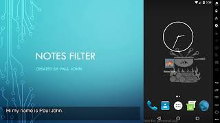

# Notes Filter
Helps students by automatically sorting all their media files by class based on when it was taken.

My app is created to solve a problem that I faced on a daily basis in school. I would take a picture of my friend’s notes, but a few weeks later when studying for my exam it would be difficult to find the image amid the thousands of images in my gallery. My app solves this by automatically sorting all your media by class based on when it was taken. 

## Demo
Here is a link to a demo video of me displaying the differnt features and capabilities of my application.

## Installation

You can check it out on the playstore: https://play.google.com/store/apps/details?id=com.coderboy19.notes.filter